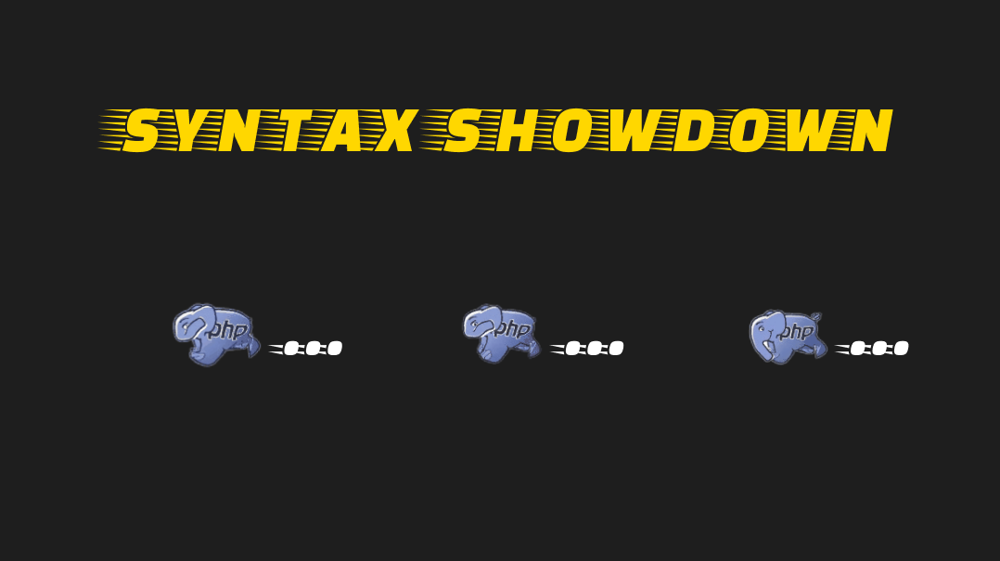
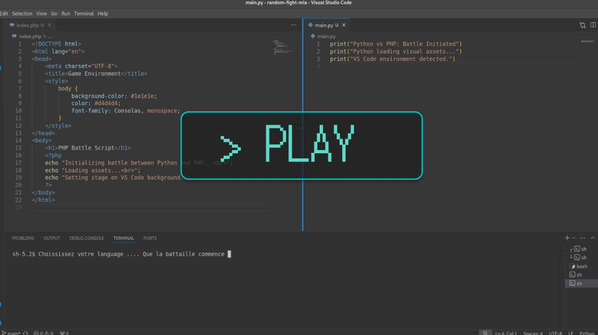
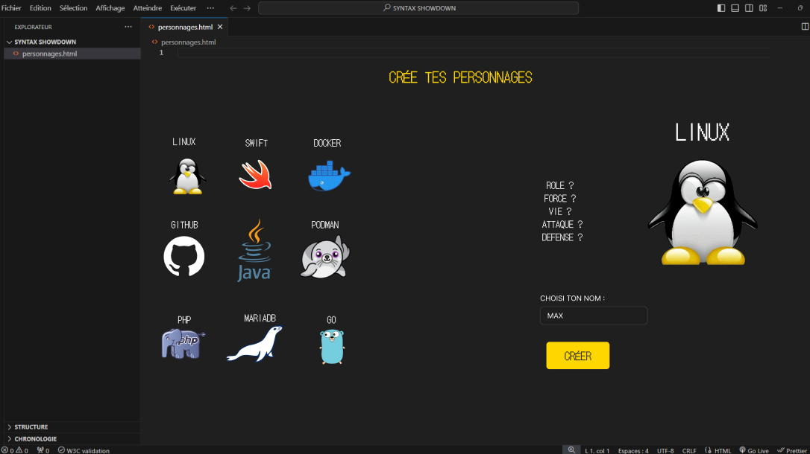
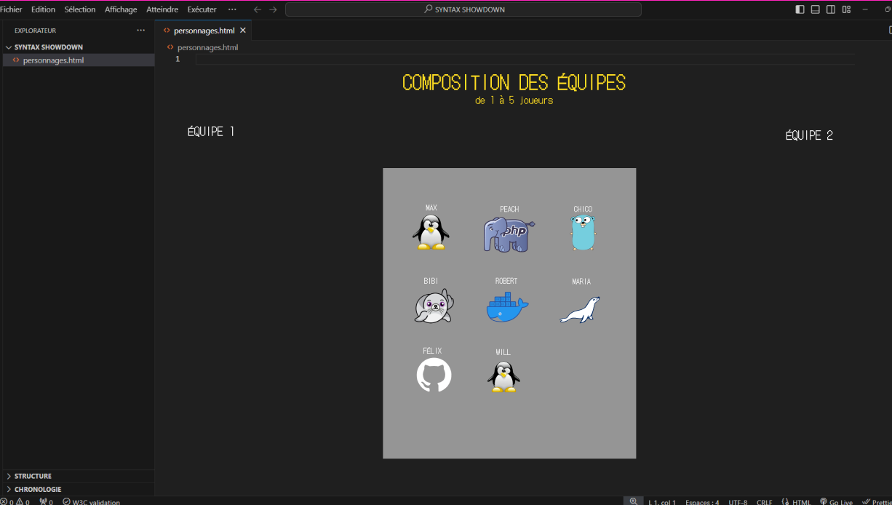
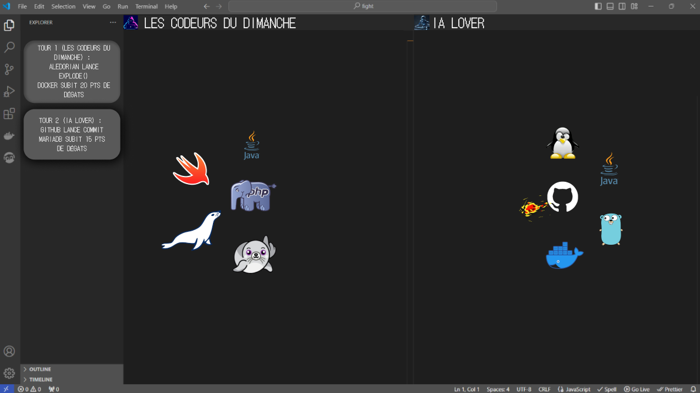
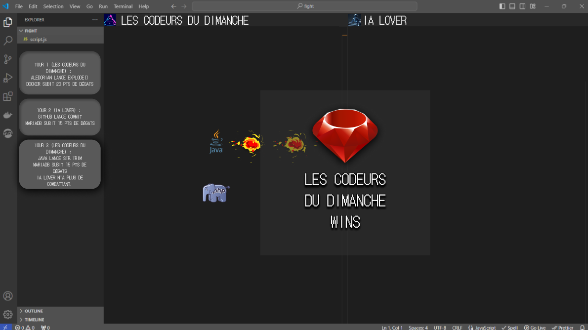
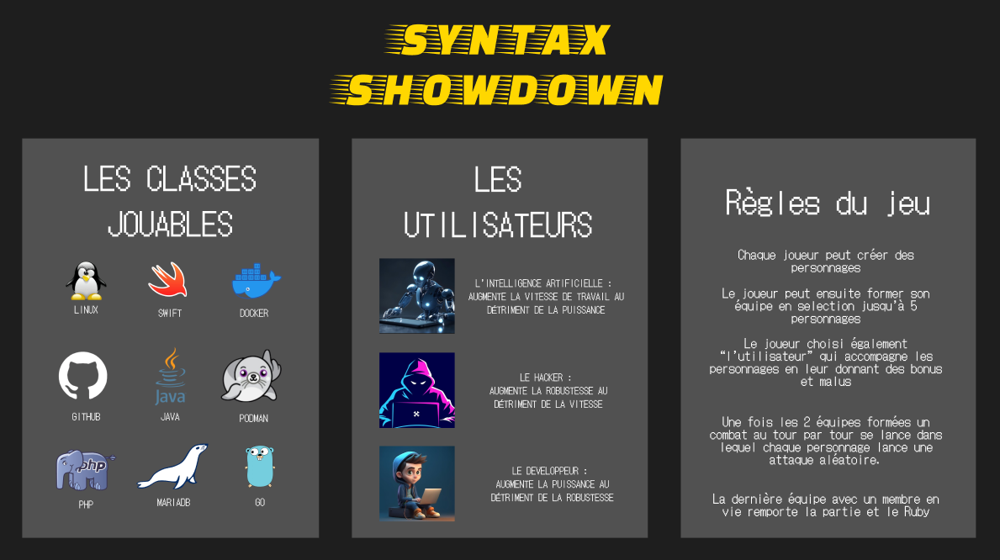

# Présentation SYNTAX SHOWDOWN

Dans Syntax Showdown, les icônes des langages de programmation et des environnements informatiques prennent vie dans une arène digitale pour un combat épique. Choisissez votre équipe et plongez dans des affrontements palpitants où chaque avatar incarne des compétences et des caractéristiques propres à son langage ou environnement.

## Illustrations:

## Lien Figma:
[SYNTAX SHOWDOWN - Figma](https://www.figma.com/design/XyOZpXPoz0Bm0cV9qcUjOh/SYNTAX-SHOWDOWN?node-id=0-1&node-type=canvas&t=EhnCLVa70WXXdrIy-0)

## Lien Backlog:
[Backlog GitHub - Syntax Showdown](https://github.com/orgs/2024-dwwm-bsm-p4/projects/22/views/1?system_template=team_planning)
